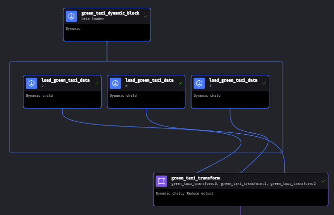

# [Mage for Workflow Orchestration](https://github.com/DataTalksClub/data-engineering-zoomcamp/tree/main/02-workflow-orchestration): Homework 🗒️

## Overview
- [Quick link to Homework](https://github.com/DataTalksClub/data-engineering-zoomcamp/blob/main/cohorts/2024/02-workflow-orchestration/homework.md?plain=1)

For Week 2, we were  directed to create a pipeline in mage which would:
1. Use pandas to **Extract** files from an online repository merge them

2. **Clean** and **Transform** the data and test it to verify against expected results
3. Perform two Load operations:
    * Load the data into a local Postgres database
    * Load the data as a partitioned parquet file to Google Cloud Storage bucket (DataLake)
5. Finally, Schedule the pipeline to run daily at 5AM

## Execution Summary

### Preface
In Mage, Pipelines are made up of **blocks**: atomic pieces of code that can be thought of as a self-contained step within the pipeline which can have a parent step and a child step.

In Mage, blocks may be set to become ***dynamic* blocks** if the output is formatted as *List [ List [ Dict ]]*.
> The number of blocks it creates is equal to the number of items in the output data of the dynamic block multiplied by the number of its downstream blocks. -- [Mage Documentation, Dynamic blocks](https://docs.mage.ai/design/blocks/dynamic-blocks)

The downstream blocks will then perform the next steps in the pipeline on each item in the iterable, *in parallel*.

These parallel threads may then be sewn back together downstream when/if necessary.

### Execution

To become more familiar with Mage's dynamic blocks, I designed my pipeline to take advantage of parallelization.

1. [green_taxi_dynamic_block](green_taxi_etl/data_loaders/green_taxi_dynamic_block.py)
    - A dynamic block that splits the multiple links to repo files among its dynamic children.
3. [load_green_taxi_data](green_taxi_etl/data_loaders/load_green_taxi_data.py)
    - Dynamic Child: 
        - input: url to a specific repo file
        - action: extracts data from its given url using pandas, parses datetime columns and validates column dtypes
        - output: pandas DataFrame
4. [green_taxi_transform](green_taxi_etl/transformers/green_taxi_transform.py)
    - Dynamic Child: 
        - input: pandas DataFrame
        - action: transforms the given DataFrame by removing anomalous rows, creates a column that may be used for partitioning, and standardizes column names
        - output: pandas DataFrame
5. [green_taxi_concatenation](green_taxi_etl/custom/green_taxi_concatenator.py)
    - Reducer Block:
        - input: List of pandas DataFrames
        - action: concatenates DataFrames together
        - output: a pandas DataFrame
6. [taxi_data_to_postgres](green_taxi_etl/data_exporters/taxi_data_to_postgres.py)
    - Normal Block:
        - input: pandas DataFrame
        - action: loads data into Postgres database
        - output: None
7. [green_taxi_to_gcs_partitioned_parquet](green_taxi_etl/data_exporters/green_taxi_to_gcs_partitioned_parquet.py)
    - Normal Block
        - input: pandas DataFrame
        - action: using pyArrow, transforms into pyArrow table, partitions by taxi pickup date, and loads partitioned file into GCS
        - output: None

Finally, I set this pipeline to [trigger every day at 5 AM](green_taxi_etl/pipelines/green_taxi_etl/triggers.yaml).
