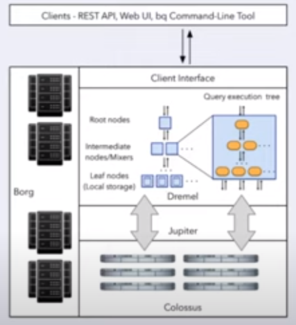

WEEK 3: DATA WAREHOUSE AND BIGQUERY

# 01 DATA WAREHOUSE (OLAP vs OLTP)

## OLAP vs OLTP

>**OLTP**: OnLine Transaction Processing
>- Used in backend services
>   - Sequences of SQL statements grouped together in form of transactions, which are rolled back if any statements fail
>    - Deal with fast and small updates, store data in normalized databases that reduce data redundancy and increase productivity of end users
>   - group a number of SQL queries together and fallback/rollback if one of them fails
>**OLAP**: Online Analytical Processing
>- composed of denormalized databases, which simplifies analytics queries and are mainly used for data mining.
>   - Main example: DataWarehouses
>    - Generally contain a lot of data from many sources (e.g. different OLTP systems) and implement [star](https://en.wikipedia.org/wiki/Star_schema) or [snowflake](https://en.wikipedia.org/wiki/Snowflake_schema) schemas that are optimized for analytical tasks.
>   - Used for data mining and analytics by data analysts or data scientists

|   | OLTP | OLAP |
|---|---|---|
| Purpose | Control and run essential business operations in real time | Plan, solve problems, support decisions, discover hidden insights |
| Data updates | Short, fast updates initiated by user | Data periodically refreshed with scheduled, long-running batch jobs |
| Database design | Normalized databases for efficiency | Denormalized databases for analysis |
| Space requirements | Generally small if historical data is archived | Generally large due to aggregating large datasets |
| Backup and recovery | Regular backups required to ensure business continuity and meet legal and governance requirements | Lost data can be reloaded from OLTP database as needed in lieu of regular backups |
| Productivity | Increases productivity of end users | Increases productivity of business managers, data analysts and executives |
| Data view | Lists day-to-day business transactions | Multi-dimensional view of enterprise data |
| User examples | Customer-facing personnel, clerks, online shoppers | Knowledge workers such as data analysts, business analysts and executives |


## Data Warehouse
A Data Warehouse is an OLAP solution
- Used for reporting and analysis
- Commonly use the ETL model (Data Lakes tend to follow ELT model)
- Consists of:
    - Raw data
    - Metadata
    - Summary Data
- May output data to data marts


## BigQuery
- Serverless data warehouse solution
    - No servers for a user to build, store, or manage on-prem or database software to install into servers/local computers
- Software as well as infrastructure
    - **scalable** and has **high availability**
        - Can start with GBs and scale to PBs without issues
    - Google takes care of underlying software and infrastructure
- Built-in features like
    - ML
    - Geospatial analysis
    - Business intelligence
- Maximizes flexibility by separating the compute engine that analyzes your data from your storage
    - Usually an on-prem server with storage and compute must be expanded or changed when data size or performance needs increase beyond its capacity

Other large cloud providers offer alternatives to BQ (AWS Redshift, Azure Synapse Analytics)

BigQuery 
- generally caches data
    - This can be disabled
- Provides access to open source public data

When a table name is selected:
- The schema tab shows the table's set schema
- The Details tab shows summary information about table size and settings

Upon running queries
- Results will appear below the query
    - Tabs available to view:
        - Job Information
        - Results
        - JSON
        - Execution details
- You can save the results as a file (e.g. csv) or explore the data using data studio

### BigQuery Cost
BQ is divided into 2 components: processing and storage, with additional charges for other operations (e.g. ingestion, extraction)

#### Storage Cost
Two storage types, with no difference in performance, durability, or availablity:
- The first 10 GB of accumulated storage (across all BQ storage types) storage/month is free.
- Active storage: any table/table partition modified in the last 90 days
    - $0.023/GB/month
- Long-term storage: any table/table partition not modified for 90 consecutive days
    - $0.016/GB/month

#### Processing Cost:
On Demand Pricing has two pricing models:
- On demand pricing
    - 1 TB of data processed is $6.25, first 1 TB/month free
    OR
- Pay-as-you-go pricing (with autoscaling) with editions
    - Standard Edition
        - $0.04/slot hour
    - Enterprise Edition
        - $0.06/slot hour
    - Enterprise Plus Edition
        - $0.01/slot hour
- Capacity pricing (flat rate per slot-hour)
    - Based on number of pre-requested slots (100 slots minimum, increasing by 100 slots)
        - 50 queries running and all slots are full, 51st must wait
        - 100 slots -> $3,494.40/month = 560.104 TB data/month processed on demand processing
            - Doesn't make sense to go for 

### BigQuery Abilities
Big Query can
- Create an **external table** based on an external source
    - The data itself is not stored within BigQuery
    - In general, can infer datatype
        - Means don't always have to define schema (but it is a possibility)
    - Is unable to determine table size, long-term storage size, or number of rows, as it's stored in an external system

```sql
-- Creating external table referring to gcs path
CREATE OR REPLACE EXTERNAL TABLE taxi-rides-ny.nytaxi.eternal_yellow_tripdata
OPTIONS (
    format = 'CSV',
    uris = ['uri_path_here', 'uri_path_here']
);
```
>[!Warning]
>BigQuery cannot determine processing costs of external tables

### BigQuery Partitioning
Datasets sometimes have unique features, such as columns with date-time data or with a finite set of categories, that are often used as search parameters.
- Partitioning the dataset by these features can make these search queries even faster (and less costly)


#### Querying partitioned vs non-partitioned
- In non-partitioned, query must search entire dataset (which can be  > 1+ GB)

```sql
-- Create a non-partitioned table from external table
CREATE OR REPLACE TABLE taxi-rides-ny.nytaxi.yellow_tripdata_non_partitioned AS
SELECT * FROM taxi-rides-ny.nytaxi.external_yellow_tripdata;
```

- In partitioned, query can quickly find the subset and only needs to search it, (which can be *very* small in comparison)
    - BigQuery has the ability to create partitioned tables

>[!IMPORTANT]
> This has a direct impact on use-cost; On-Demand Processing charges by size of data processed

```sql
-- Create a partitioned table from external table
CREATE OR REPLACE TABLE taxi-rides-ny.nytaxi.yellow_tripdata_partitioned
PARTITION BY
    DATE(tpep_pickup_datetime) AS
SELECT * FROM taxi-rides-ny.nytaxi.external_yellow_tripdata;
```

It is possible to examine how many rows fall into each partition.
- It may be helpful to determine if there's some bias in the partition (some partitions are getting more rows and some are getting less).

```sql
-- Examining the partitions
SELECT table_name, partition_id, total_rows
FROM 'nytaxi.INFORMATION_SCHEMA.PARTITIONS'
WHERE table_name = yellow_tripdata_partitioned
ORDER BY total_rows DESC;
```

### BigQuery Clustering
Similar to a partition, groups unique features together - but within each partition.
- This can improves query performance even more (by cutting down on the amount of data processed)
- The choice of what to cluster by depends on *how* the data tends to be queried


```sql
-- Creating a partition and cluster table
CREATE OR REPLACE TABLE taxi-rides-ny.nytaxi.yellow_tripdata_partitioned_clustered
PARTITION BY DATE(tpep_pickup_datetime)
CLUSTER BY VendorID AS
SELECT * FROM taxi-rides-ny.nytaxi.external_yellow_tripdata;
```

-----------------
# 02 PARTITIONING VS CLUSTERING

When creating a **partition** table in BigQuery, can choose to partition by:
- Time-unit column or ingestion time (_PARTITIONTIME)
    - Daily (Default)
        - Data is usually medium size and distributed evenly across different days
    - Hourly
        - Best if a HUGE amount of data coming in and want to process data based on each hour
        - May want to consider number of partitions created:
            - BigQuery limits partitions to 4,000
        - May want to have an expire partitioning strategy
    - Monthly or yearly
        - Generally when there's a smaller amount of data, but still spans across these ranges
- Integer range partitioning

When doing clustering in BigQuery:
- Columns specified used to colocate related data
- Order of the column is important
    - Order of the specified columns determines the sort order of the data
    - Example:
        - Clustering on columns A, B, C
        - Order of sorting would be A -> B -> C
- Can specify up to four clustering columns
- Clustering columns must be top-level, non-repeated columns
    - Must be of the following types:
        - DATE
        - BOOL
        - GEOGRAPHY
        - INT64
        - NUMERIC
        - BIGNUMERIC
        - STRING
        - TIMESTAMP
        - DATETIME
- Clustering improves
    - Filter queries
    - Aggregate queries

- Table with data size < 1 GB don't tend to show significant improvement with partitioning and clustering
    - In this case, would incur significant cost
        - Partitioning and clustering tables incur metadata reads and metadata maintenance

| Clustering | Partitioning |
|---|---|
| Cost benefit unknown. BQ cannot estimate the reduction in cost before running a query. | Cost known upfront. BQ can estimate the amount of data to be processed before running a query. |
| High granularity. Multiple criteria can be used to sort the table. | Low granularity. Only a single column can be used to partition the table. |
| Clusters are "fixed in place". | Partitions can be added, deleted, modified or even moved between storage options. |
| Benefits from queries that commonly use filters or aggregation against multiple particular columns. | Benefits when you filter or aggregate on a single column. |
| Unlimited amount of clusters; useful when the cardinality of the number of values in a column or group of columns is large. | Limited to 4000 partitions; cannot be used in columns with larger cardinality. |

- If it is important to constrain queries within a certain cost, partitioning is very important
    - While running queries in BigQuery, can specify that if your cost exceeds x amount for a particular query then don't execute it
        - This is not possible to do with just clustering - must do partitioning to know upfront costs

- BigQuery can do partition-level management
    - deleting, creating new partitions, or moving partitions between storage
    - Not possible to do in clustering

### When to use Clustering over Partitioning
When Partitioning results in:
- a small amount of data per partition (approximately less than 1 GB)
- a large number of partitions beyond the limits of partitioned tables (columns have too much granularity)
- your mutation operations modifying the majority of partitions in the table frequently (for example, every few minutes)

### Automatic reclustering in BigQuery
***Automatic reclustering*** is done in the background and does not cost the end-user anything

As data is added to a clustered table
- The newly inserted data can be written to blocks that contain key ranges that overlap with the key ranges in previously written blocks
- These overlapping keys weaken the sort property of the table
To maintain the performance characteristics of a clustered table
- BigQuery performs automatic re-clustering in the background to restore the sort property of the table
- For partitioned tables, clustering is maintained for data within the scope of each partition

-----------------
# 03 BIGQUERY BEST PRACTICES

Most efforts are focused on either **cost reduction** or **improving query performance**

## Cost reduction
- Avoid `SELECT *`, specify column names whenever possible
    - Big Query stores data in column format
        - When columns are specified, only that data is being read
- Price your queries before running them
    - Price can be seen on right hand side top corner
- Use clustered or partitioned tables
- Use streaming inserts with caution
    - These can increase cost drastically
- [Materialize query](https://cloud.google.com/bigquery/docs/materialized-views-intro) results in different stages
    - Example: using a CTE and using it in multiple stages
        - Makes sense to materialize them before using them in multiple locations
    - BigQuery caches query results

## Query Performance
- Filter on partitioned columns
- [Denormalize data](https://cloud.google.com/blog/topics/developers-practitioners/bigquery-explained-working-joins-nested-repeated-data)
- Use [nested or repeated columns](https://cloud.google.com/blog/topics/developers-practitioners/bigquery-explained-working-joins-nested-repeated-data)
    - If there's a complicated structure
    - Helps in denormalizing data
- Use external data sources appropriately
    - Don't use it very much if you want high query performance
        - While reading from GCS, may incur more cost
- Reduce data before using a `JOIN`
- Don not treat `WITH` clauses as [prepared statements](https://www.wikiwand.com/en/Prepared_statement)
- Avoid [oversharding tables](https://cloud.google.com/bigquery/docs/partitioned-tables#dt_partition_shard)
- Avoid JavaScript user-defined functions
- Use [approximate aggregation functions](https://cloud.google.com/bigquery/docs/reference/standard-sql/approximate_aggregate_functions) rather than precise ones such as [HyperLogLog++](https://cloud.google.com/bigquery/docs/reference/standard-sql/hll_functions)
- Order Last, for query operations to maximize performance
- [Optimize join patterns](https://cloud.google.com/bigquery/docs/best-practices-performance-compute#optimize_your_join_patterns)
- Place the table with the *largest* number of rows first, followed by the table with the *fewest* rows, then place the remaining tables by decreasing size
    - By having the largest table as the first one, it will get distributed evenly, while the second table would be broadcasted to all the nodes

-----------------
# 04 BIGQUERY INTERNALS

## Columnar vs Record-oriented storage: a diversion


***Record-oriented*** (aka *row-oriented*) structure
- Traditional method for tabular data storage
- Data read sequentially row by row, then columns are accessed per row
- Easy for humans to process and understand
- Examples: csv
    - Each new line in the file is a record and all the info for that specific record is contained within that line

***Column-oriented*** (aka *columnar*) structure
- Data stored according to the columns of the table rather than the rows
- Allows us to only query the columns we're interested in, which reduces the amount of processed data
    - General practice is to query a few columns, and filter and aggregate on some of them
- Examples: BigQuery, other columnar databases

## BigQuery Internals
Generally don't need to know BigQuery internals if you know about best practices, partitioning, and clustering.
However, knowing how BigQuery works may help in building a data product in the future.

BigQuery is built on 4 infrastructure technologies.

- ***Dremel***: the *compute* part of BQ. It executes the SQL queries.
    - Dremel turns SQL queries into *execution trees*. The leaves of these trees are called slots and the branches are called *mixers*.
    - The *slots* are in charge of reading data from storage and perform calculations.
    - The *mixers* perform aggregation.
    - Dremel dynamically apportions slots to queries as needed, while maintaining fairness for concurrent queries from multiple users.
- ***Colossus***: Google's global storage system.
    - BQ leverages a *columnar storage format* and compression algorithms to store data.
    - Colossus is optimized for reading large amounts of structured data.
    - Colossus also handles replication, recovery and distributed management.
- ***Jupiter***: the network that connects Dremel and Colossus.
    - Jupiter is an in-house network technology created by Google which is used for interconnecting its datacenters.
- ***Borg***: an orchestration solution that handles everything.
    - Borg is a precursor of Kubernetes.



Big Query separates data storage from the compute that performs the queries, and they are connected to each other via a fast network

***Colossus***: The separated BigQuery storage
- Colossus is a cheap storage which stores data in columnar format
- Because BigQuery separates storage from compute, it has significantly less cost
    - If data size increases, generally only have to pay for storage cost (cheap)
    - Most of the cost comes from reading the data/running queries, which is compute

Potential disadvantage of separating compute from storage: a bad network may result in high query time

BigQuery uses ***Jupiter*** network
- Inside BigQuery datacenters
- Provides one TB/sec network speed, lowering latency

***Dremel***: BigQuery's query execution engine
- modifies queries to create an execution tree
- The leaves of this tree (slots) access Colossus and retrieve the data
    - Columnar format is perfect for workflow
        - Nodes retrieve of selected columns very quickly and perform any needed computation
        - Nodes return computed data to the mixers, which perform necessary aggregation
        - Mixers return aggregated data to root server, which composes the output of the query


- The distribution of workers is why BigQuery is so fast

-----------------
# 05 BIGQUERY MACHINE LEARNING

Target audience for BigQuery ML: Data Analysts, managers
- No need for Python or Java knowledge
- No need to export data into a different system
- Just need to know SQL and some machine learning algorithms

Pricing:
Use ML in BigQuery or build own model separately
- Free
    - 10 GB/month of data storage
    - 1 TB per month of queries processed
    - ML Create model step: First 10 GB/month free
- After Free Tier
    - Logistic, Linear regression models, K-means clustering model, Time series model
        - $250.00/TB processing
    - AutoML Tables  model: DNN model, Boosted tree model
        - $5.00/TB + Vertex AI training cost


BigQuery helps with these steps:
- Allows feature engineering
    - also has automatic feature engineering
- Can split data in training and evaluation steps
- Allows choice between different algorithms
- Allows hyperparameter tuning
- Provides many error matrices for performing validation
- Allows model deployment using a docker image


-----------------
# 07 HOMEWORK

## Week 3 Homework
ATTENTION: At the end of the submission form, you will be required to include a link to your GitHub repository or other public code-hosting site. This repository should contain your code for solving the homework. If your solution includes code that is not in file format (such as SQL queries or shell commands), please include these directly in the README file of your repository.

<b><u>Important Note:</b></u> <p> For this homework we will be using the 2022 Green Taxi Trip Record Parquet Files from the New York
City Taxi Data found here: </br> https://www.nyc.gov/site/tlc/about/tlc-trip-record-data.page </br>
If you are using orchestration such as Mage, Airflow or Prefect do not load the data into Big Query using the orchestrator.</br> 
Stop with loading the files into a bucket. </br></br>
<u>NOTE:</u> You will need to use the PARQUET option files when creating an External Table</br>

<b>SETUP:</b></br>
Create an external table using the Green Taxi Trip Records Data for 2022. </br>
Create a table in BQ using the Green Taxi Trip Records for 2022 (do not partition or cluster this table). </br>
</p>

## Question 1:
Question 1: What is count of records for the 2022 Green Taxi Data??
- 65,623,481
- 840,402
- 1,936,423
- 253,647

## Question 2:
Write a query to count the distinct number of PULocationIDs for the entire dataset on both the tables.</br> 
What is the estimated amount of data that will be read when this query is executed on the External Table and the Table?

- 0 MB for the External Table and 6.41MB for the Materialized Table
- 18.82 MB for the External Table and 47.60 MB for the Materialized Table
- 0 MB for the External Table and 0MB for the Materialized Table
- 2.14 MB for the External Table and 0MB for the Materialized Table


## Question 3:
How many records have a fare_amount of 0?
- 12,488
- 128,219
- 112
- 1,622

## Question 4:
What is the best strategy to make an optimized table in Big Query if your query will always order the results by PUlocationID and filter based on lpep_pickup_datetime? (Create a new table with this strategy)
- Cluster on lpep_pickup_datetime Partition by PUlocationID
- Partition by lpep_pickup_datetime  Cluster on PUlocationID
- Partition by lpep_pickup_datetime and Partition by PUlocationID
- Cluster on by lpep_pickup_datetime and Cluster on PUlocationID

## Question 5:
Write a query to retrieve the distinct PULocationID between lpep_pickup_datetime
06/01/2022 and 06/30/2022 (inclusive)</br>

Use the materialized table you created earlier in your from clause and note the estimated bytes. Now change the table in the from clause to the partitioned table you created for question 4 and note the estimated bytes processed. What are these values? </br>

Choose the answer which most closely matches.</br> 

- 22.82 MB for non-partitioned table and 647.87 MB for the partitioned table
- 12.82 MB for non-partitioned table and 1.12 MB for the partitioned table
- 5.63 MB for non-partitioned table and 0 MB for the partitioned table
- 10.31 MB for non-partitioned table and 10.31 MB for the partitioned table


## Question 6: 
Where is the data stored in the External Table you created?

- Big Query
- GCP Bucket
- Big Table
- Container Registry


## Question 7:
It is best practice in Big Query to always cluster your data:
- True
- False


## (Bonus: Not worth points) Question 8:
No Points: Write a SELECT count(*) query FROM the materialized table you created. How many bytes does it estimate will be read? Why?

 
## Submitting the solutions

* Form for submitting: TBD
* You can submit your homework multiple times. In this case, only the last submission will be used. 

Deadline: TBD